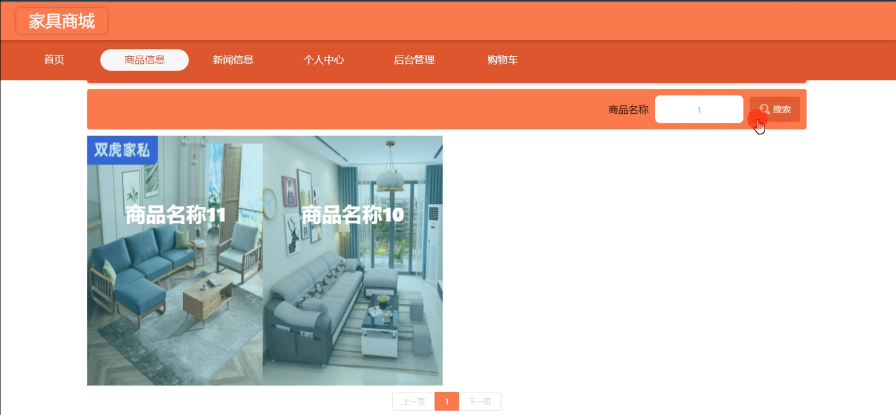

# 基于SpringBoot的在线家具商城

#### 介绍

随着互联网的普及和电子商务的迅速发展，为了满足消费者便捷购买家具的需求，我们开发了这个基于 Spring Boot 的在线家具商城。该商城为管理员和用户提供了丰富的功能和便捷的操作，旨在打造一个高效、优质的家具购物平台。

#### 技术栈

后端技术栈：Springboot+Mysql+Maven

前端技术栈：Vue+Html+Css+Javascript+ElementUI

开发工具：Idea+Vscode+Navicate

#### 系统功能介绍

（一）管理员角色  
个人中心：管理员可以在此查看和修改个人信息，接收系统通知和重要消息。  
管理员管理：对其他管理员的账号进行管理，包括添加新管理员、修改管理员权限、删除管理员账号等操作，以确保管理团队的合理配置和权限分配。  
用户管理：查看用户的详细信息，对用户账号进行启用、禁用、信息修改等操作，以保障用户信息的准确性和安全性，同时处理用户的违规行为。  
商品信息管理：负责家具商品的添加、删除、修改和更新，包括商品的名称、描述、图片、规格、价格、库存等信息，确保商品信息的准确和完整，以吸引用户购买。  
新闻信息管理：发布和管理与家具行业相关的新闻、促销活动、新品推荐等信息，保持用户对商城的关注和兴趣。  
基础数据管理：维护商城运行所需的基础数据，如商品分类、品牌、支付方式、配送方式等，为商城的正常运营提供支持。  
轮播图信息：设置商城首页的轮播图，展示热门商品、促销活动、品牌形象等，吸引用户的注意力，提高商城的点击率和转化率。  

（二）用户角色  
商品信息：用户可以浏览各类家具商品的详细信息，包括图片、描述、规格、价格等，以便做出购买决策。  
新闻信息：及时了解商城的最新活动、促销优惠、新品上市等新闻动态，不错过任何购物机会。  
个人中心：用户在此可以修改个人资料、查看订单记录、收货地址管理、查看积分和优惠券等。  
后台管理  
商品信息管理：对关注或购买过的商品进行评价和反馈，帮助其他用户了解商品的实际情况。  
新闻信息管理：查看历史新闻，方便获取所需的信息。  
购物车：用户可以将心仪的商品添加到购物车，方便统一结算和管理购买意向。  

#### 系统作用

在线家具商城系统的主要作用包括：  

提升购物体验： 为用户提供一个便捷的在线购物平台，用户可以随时随地浏览和购买家具商品。  
优化管理效率： 提供全面的管理工具，帮助管理员高效管理用户、商品、新闻和基础数据等。  
信息传递： 通过新闻信息和轮播图，管理员可以及时向用户传递最新的商品资讯和活动信息。  
增加销售渠道： 通过在线商城，家具商家可以拓宽销售渠道，吸引更多的潜在客户。  

#### 系统功能截图

代码结构

数据库表

登录

前台页面首页

商品信息

个人中心

购物车

管理员端个人信息

用户管理

商品信息订单管理

轮播图管理

商品评价管理

#### 总结

基于 Spring Boot 的在线家具商城通过清晰的角色划分和丰富的功能模块，为用户提供了便捷的购物环境，为管理员提供了高效的管理工具。它不仅促进了家具销售的数字化转型，还提升了用户的购物满意度和商家的运营管理水平。未来，随着技术的不断进步和用户需求的变化，商城将持续优化和创新，为家具行业的发展注入新的活力。

#### 使用说明

创建数据库，执行数据库脚本 修改jdbc数据库连接参数 下载安装maven依赖jar 启动idea中的springboot项目

前台登录页面
http://localhost:8080/jiajushangcheng/front/index.html

后台登录页面
http://localhost:8080/jiajushangcheng/admin/dist/index.html

管理员			账户:admin      密码：admin
用户				账户:a1 		密码：123456
用户				账户:a2 		密码：123456
用户				账户:a3 		密码：123456